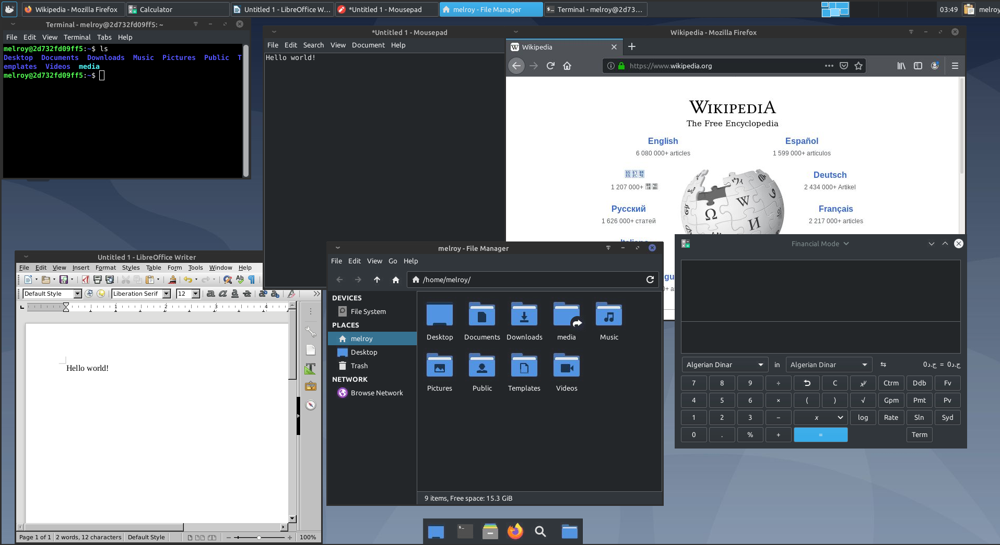

# XFCE VDI (X2Go)

Docker image for running [Debian](https://hub.docker.com/_/debian) and [XFCE](https://www.xfce.org/) by leveraging the [X2Go protocol](https://wiki.x2go.org/doku.php/download:start).

## Purpose

This docker image enables you to start one or more instances of a Virtual Desktop Infrastructure (VDI). Without the need of VM's!

* By utilizing [Docker containers](https://www.docker.com/resources/what-container), there will be **NO** boot of whole operating system (like VMs do), instead docker will use the OS kernel resources and shares them with the docker container. Resulting in much faster start-up times than VMs can every do.

* By using the [X2Go protocol](https://wiki.x2go.org/) it's easy to connect/share sessions between the client and the server. Which allows remote working or any other task you might want do remotely in a windowing system.

* The image contains a [docker GNU/Linux Debian](https://hub.docker.com/_/debian) (bullseye) operating system, together with XFCE4 desktop environment. The required X2Goserver/X2Gosession are already pre-installed.

* In fact, this Docker image has alot of packages pre-installed you probably want anyway, including but not limited to: `Firefox`, `LibreOffice`, `gnome-calculator`, `archiver`, `file manager`, `text editor`, `image viewer`, `htop`, `clipboard manager` and much more.

* Last but not least, the image is preconfigured with a nice dark-theme (Breeze-Dark), window theme (Mint-Y-Dark) as well as a nice looking icon set (Mint-Y-Dark-Aqua) and uses Ubuntu fonts by default. See below an preview:


Or an example with Papirus icons:



*Note 1:* You can always remove/install additional packages. By using the Docker container and apt-get command line (this won't be permanent). Or ideally, by changing [Dockerfile](Dockerfile) or extending the Docker image instead via: `FROM danger89/xfcevdi_x2go` in your own Dockerfile. 

*Note 2:* Optionally adapt the [XFCE settings script](xfce_settings.sh) to your needs. Eg. when you installed the Papirus icon theme and you want to use use the Papirus icons instead Mint-Y-Dark-Aqua icons.

## Usage

*Note:* If the image is not yet available on your system, the Docker image will be retrieved from [DockerHub](https://hub.docker.com/r/danger89/xfcevdi_x2go) by default.

Start the docker container using (with username: `user`, password: *is auto-generated*, port: `2222`):

```sh
docker run --shm-size 2g -it -p 2222:22 danger89/xfcevdi_x2go:latest
```

Or with the username `melroy` with password `abc` on host `localhost` and port: `2222`:

```sh
docker run --shm-size 2g -it -p 2222:22 -e USERNAME=melroy -e PASS=abc danger89/xfcevdi_x2go:latest
```

## Build

You do not need to build the image, instead you can use [the dockerhub image](https://hub.docker.com/r/danger89/xfcevdi_x2go) if you want.

Build the image locally, via:

```sh
docker build --tag danger89/xfcevdi_x2go .
```

Or when you have [apt-cacher](http://manpages.ubuntu.com/manpages/jammy/man8/apt-cacher.8.html) or [apt-cacher-ng](http://manpages.ubuntu.com/manpages/jammy/en/man8/apt-cacher-ng.8.html) proxy installed, use `APT_PROXY` parameter to set the proxy URL: `docker build --build-arg APT_PROXY=http://melroy-pc:3142 --tag danger89/xfcevdi_x2go .`. Where `melroy-pc` is your hostname.

### Docker compose

You can also use a docker-compose file!
See the [docker compose file](vdi-compose.yml) within this git repository.

### Environment variables

Available environment variables (use `-e` flag during `docker run`) are:

| Env. variable    | Type    | Description                                 | Default value          |
|------------------|---------|---------------------------------------------|------------------------|
| `USERNAME`       | string  | Provide another username                    | `user`                 |
| `USER_ID`        | integer | Provide another GUID/user ID                | `1000`                 |
| `PASS`           | string  | Change password for user                    | *auto-generated pass*  |
| `ROOT_PASS`      | string  | Change password for root-user               | *auto-generated pass*  |
| `ALLOW_ROOT_SSH` | boolean | Allow root access via SSH                   | `false`                |
| `ENTER_PASS`     | boolean | Require to enter password for sudo commands | `false`                |

## Update VDI

1. Stop docker container (`docker stop <container_id>`)
2. Get latest version: `docker pull danger89/xfcevdi_x2go`
3. Start docker container again (either via `docker run` or using `docker-compose`)

## Clients

X2Go has two clients available to choose from:

* X2Go Client (recommended)
* PyHoca-GUI

Which can both be [downloaded from their site](https://wiki.x2go.org/doku.php/download:start). Clients are available for Windows/Mac and/or GNU/Linux operating systems.

Once you open the client, create a new session by providing the following settings (default settings):

* Host: host IP addresss (or domain name or `localhost`)
* Login: `user` (default username)
* SSH port: `2222` (default port)
* Session type: `XFCE` (select from drop-down menu)

Once you try to connect, accept the new SSH host key and you'll require to enter a password (by default the **passwords are auto-generated**!).
