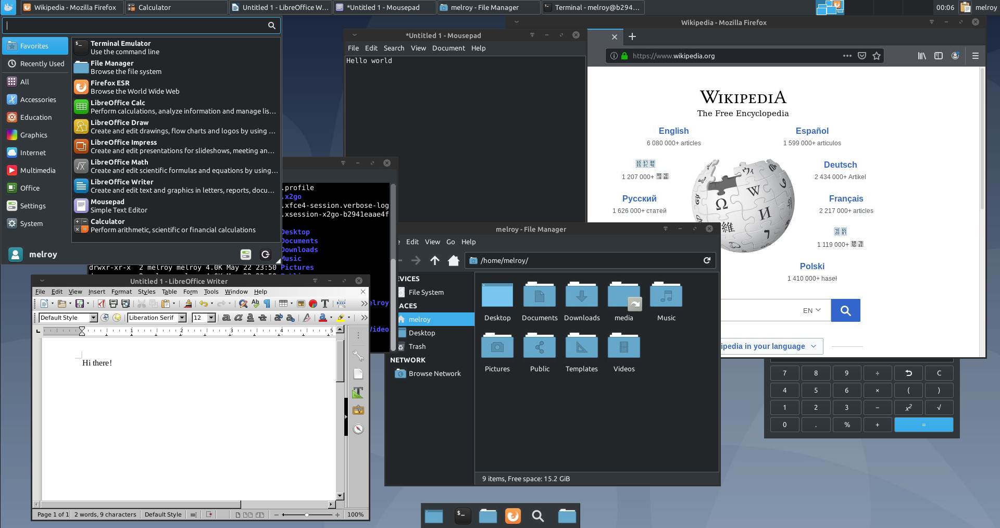

# XFCE VDI (X2Go)

Docker image for running [Debian](https://hub.docker.com/_/debian) and [XFCE](https://www.xfce.org/) by using the [X2Go protocol](https://wiki.x2go.org/doku.php/download:start).

## Purpose

This docker image enables you to start one or more instances of a Virtual Desktop Infrastructure (VDI).

By using [Docker](https://www.docker.com/resources/what-container), there will be **NO** boot of whole operating system (like VMs are), instead docker will use the kernel resources and shares them with the docker container.

By using the [X2Go protocol](https://wiki.x2go.org/) to easily connect/share sessions between the client and the server. Which allows remote working or any other task you might want do remotely in a windowing system.

The image contains a docker [GNU/Linux Debian](https://hub.docker.com/_/debian) (buster) operating system, together with XFCE4 desktop environment. X2Goserver/X2Gosession are already pre-installed.

In fact, the image has alot of packages installed you properbly need, including but not limited to: `Firefox`, `LibreOffice`, `gnome-calculator`, `archiver`, `file manager`, `text editor`, `image viewer`, `htop`, `clipboard manager` and much more.

Last but not least, the image is preconfigured with a nice dark-theme (Breeze-Dark), window theme (Mint-y-dark) as well as a nice icon set (Papirus-Dark) and uses Ubuntu fonts by default. See below:



*Note:* You can always remove/install additional packages. By using docker container and apt-get command line (depending on your setup, this won't be permanent) or ideally by changing the [Dockerfile](Dockerfile). And optionally adapt [XFCE settings script](xfce_settings.sh) to your needs.

## Build

Build the image locally, via:

```sh
docker build --tag vdi .
```

Or when you have [apt-cacher](http://manpages.ubuntu.com/manpages/focal/man8/apt-cacher.8.html) proxy installed, use `APT_PROXY` parameter to set the proxy URL: `docker build --build-arg APT_PROXY=http://melroy-pc:3142 --tag vdi .`


## Usage

Start the docker container using (username: `user` and password will be auto-generated):

```sh
docker run --shm-size 2g -it -p 2222:22 vdi:latest
```

Or with the username `melroy` with password `abc`:

```sh
docker run --shm-size 2g -it -p 2222:22 -e USERNAME=melroy -e PASS=abc vdi:latest
```

Available options (use `-e` flag during `docker run`) are:

* USERNAME - provide another username (default: `user`)
* USER_ID - provide another GUID/user ID (default: `1000`)
* PASS - change password for user (default auto-generated)
* ROOT_PASS - change password for root-user (default auto-generated)
* ALLOW_ROOT_SSH - allow root access via SSH (default `false`, otherwise to set to `true`)
* ENTER_PASS - require to enter password for sudo root commands (default `false`, otherwise to set to `true`)

## Clients

X2Go has two clients available to choose from:

* X2Go Client (recommended)
* PyHoca-GUI

Which can both be [downloaded from their site](https://wiki.x2go.org/doku.php/download:start) for Windows/Mac and Linux.

Once started create a new session and provide the following info:

* Host: host IP addresss (or domain)
* Login: username (default: `user`)
* SSH port: 2222 (if you use the docker run command above)
* Session type: XFCE (select from drop-down)

## TODOs

* Add PulseAudio plugin to panel